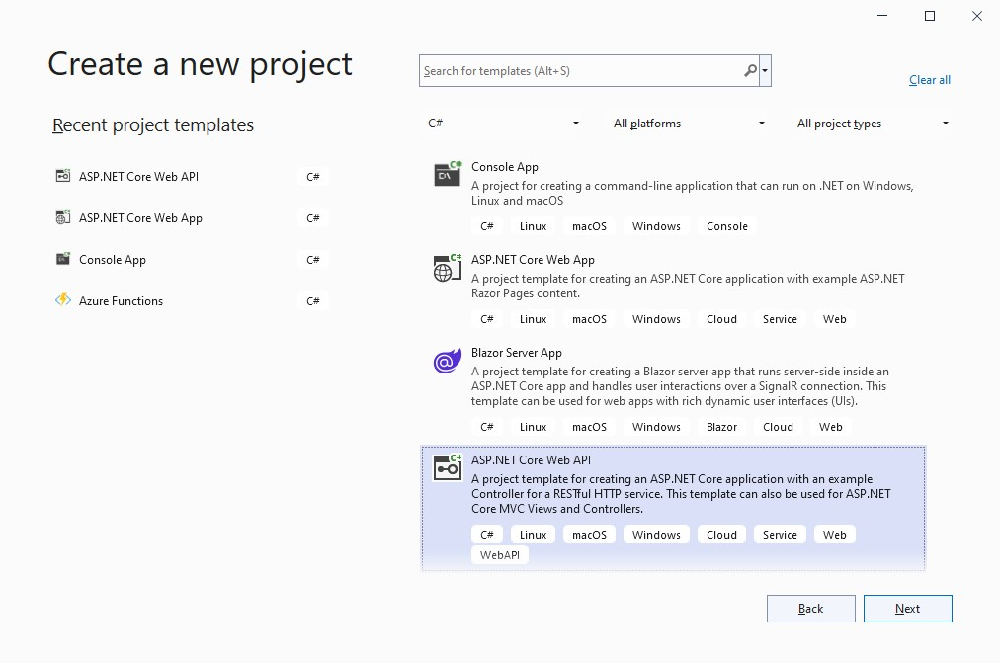
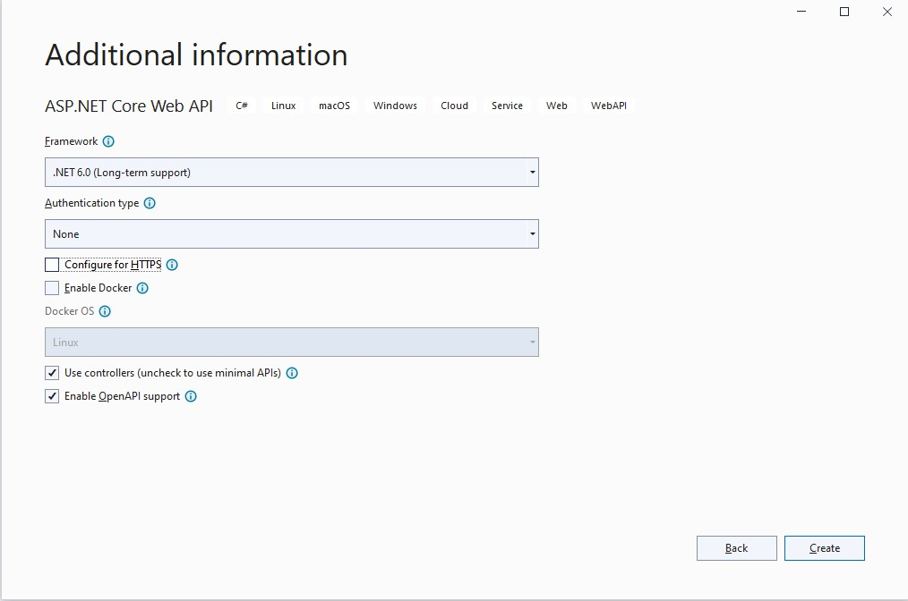

# C#.NET Training: Resources

## Contents

 - [Fundamentals](#Fundamentals)
 - [Working Mode](#working-mode)
 - [Environment](#environment)
 - [Time Bookings](#time-bookings)
 - [Online Shop](#online-shop)
 - [Chapters](#chapters)
   * [0. Prerequisites](#0-prerequisites)
   * [1. WEB API](#1-web-api)
		* [1.1. Create Web API project](#11-create-web-api-project)
		* [1.2. Test your app](#12-test-your-app)
		* [1.3. Local drive access](#13-local-drive-access)
		* [1.4. Logging](#14-logging)    
		* [1.5. Exception Handling](#15-exception-handling)
   * [2. Database access](#2-database-access)
		* [2.1. ADO.NET](#21-adonet)
		* [2.2. Entity Framework](#22-entity-framework)		
   * [3. Create GUI](#3-create-gui)
		* [3.1. Using Angluar vs. React vs. Vue](#31-using-angluar-vs-react-vs-vue)
		* [3.2. Using Windows Forms vs. WPF](#32-using-windows-forms-vs-wpf)		
		* [3.3. Using Razor vs. Blazor](#33-using-razor-vs-blazor)
   * [4. Security](#4-security)
   * [5. Unit tests](#5-unit-tests)
   * [OPT-1. ODBC](#opt-1-odbc)
   * [OPT-2. MongoDB](#opt-2-mongodb)
   * [OPT-3. OAuth](#opt-3-oauth)
   * [OPT-4. RabbitMQ](#opt-6-rabbitmq)
   * [OPT-5. WebSocket](#opt-8-websocket)

## Fundamentals

C# is a object-oriented and type-safe programming language. C# enables developers to build many types of applications that run in .NET.

C# programs run on .NET, a virtual execution system called the common language runtime (CLR) and a set of class libraries. The CLR is the implementation by Microsoft of the common language infrastructure (CLI), an international standard.

What is .NET?
.NET is a free, open-source development platform for building many kinds of apps, such as:

- Web apps, web APIs, and microservices
- Serverless functions in the cloud
- Cloud native apps
- Mobile apps
- Desktop apps
- Windows WPF
- Windows Forms
- Universal Windows Platform (UWP)
- Games
- Internet of Things (IoT)
- Machine learning
- Console apps
- Windows services

Types and variables

A type defines the structure and behavior of any data in C#. The declaration of a type may include its members, base type, interfaces it implements, and operations permitted for that type. A variable is a label that refers to an instance of a specific type.

There are two kinds of types in C#: value types and reference types. Variables of value types directly contain their data. Variables of reference types store references to their data, the latter being known as objects. With reference types, it's possible for two variables to reference the same object and possible for operations on one variable to affect the object referenced by the other variable. With value types, the variables each have their own copy of the data, and it isn't possible for operations on one to affect the other (except for ref and out parameter variables).

An identifier is a variable name. An identifier is a sequence of unicode characters without any whitespace. An identifier may be a C# reserved word, if it's prefixed by @. Using a reserved word as an identifier can be useful when interacting with other languages.

C#'s value types are further divided into simple types, enum types, struct types, nullable value types, and tuple value types. C#'s reference types are further divided into class types, interface types, array types, and delegate types.

- Value types (https://docs.microsoft.com/en-us/dotnet/csharp/language-reference/builtin-types/value-types)
  - Simple types
  - Enum types
  - Struct types
  - Nullable value types
  - Tuple value types
- Reference types (https://docs.microsoft.com/en-us/dotnet/csharp/language-reference/keywords/reference-types)
  - Class types
  - Interface types
  - Array types
  - Delegate types

C# programs use type declarations to create new types. A type declaration specifies the name and the members of the new type. Six of C#'s categories of types are user-definable: class types, struct types, interface types, enum types, delegate types, and tuple value types. You can also declare record types, either record struct, or record class. Record types have compiler-synthesized members. You use records primarily for storing values, with minimal associated behavior.

- A class type defines a data structure that contains data members (fields) and function members (methods, properties, and others). Class types support single inheritance and polymorphism, mechanisms whereby derived classes can extend and specialize base classes.
https://docs.microsoft.com/en-us/dotnet/csharp/language-reference/keywords/class

- A struct type is similar to a class type in that it represents a structure with data members and function members. However, unlike classes, structs are value types and don't typically require heap allocation. Struct types don't support user-specified inheritance, and all struct types implicitly inherit from type object.
https://docs.microsoft.com/en-us/dotnet/csharp/language-reference/builtin-types/struct

- An interface type defines a contract as a named set of public members. A class or struct that implements an interface must provide implementations of the interface's members. An interface may inherit from multiple base interfaces, and a class or struct may implement multiple interfaces.
https://docs.microsoft.com/en-us/dotnet/csharp/language-reference/keywords/interface

- A delegate type represents references to methods with a particular parameter list and return type. Delegates make it possible to treat methods as entities that can be assigned to variables and passed as parameters. Delegates are analogous to function types provided by functional languages. They're also similar to the concept of function pointers found in some other languages. Unlike function pointers, delegates are object-oriented and type-safe.
https://docs.microsoft.com/en-us/dotnet/csharp/programming-guide/delegates/using-delegates

Object Oriented programming

- Classes, structs, and records
  Definition of a class, struct, or record—is like a blueprint that specifies what the type can do. An object is basically a block of memory that has been allocated and configured according to the blueprint. This article provides an overview of these blueprints and their features. The next article in this series introduces objects. https://docs.microsoft.com/en-us/dotnet/csharp/fundamentals/tutorials/oop

- Object is basically a block of memory that has been allocated and configured according to the blueprint.
  https://docs.microsoft.com/en-us/dotnet/csharp/fundamentals/object-oriented/objects 

- Inheritance enables you to create new classes that reuse, extend, and modify the behavior defined in other classes.
  https://docs.microsoft.com/en-us/dotnet/csharp/fundamentals/object-oriented/inheritance

- Polymorphism is the ability of objects of different types to provide a unique interface for different implementations of methods
  https://docs.microsoft.com/en-us/dotnet/csharp/fundamentals/object-oriented/polymorphism

## Working Mode

The road-map consists of several steps. In each step, a set of theoretical concepts are explored, supported by reference documentation, book chapters, tutorials and videos. In parallel, a simple application will be built with the learned concepts: the *Online Shop* application.

After the learning material for a given step was sufficiently explored, either some new functionality will be added to this application or old functionality will be refactored.

The application will have little-to-no user interface. Developers are expected to perform developer tests with Postman once the REST APIs are implemented OR Swagger

All the code written must be published on GitHub. Commits must be pushed when each individual chapter is finished. In order to request a code review from the trainers, you must [open a pull request](https://help.github.com/en/articles/creating-a-pull-request) from the `develop` to the `master` branch.

## Environment

You can work using your local environment:
 - You can install [.NET 6.0 SDK (LTS)](https://dotnet.microsoft.com/en-us/download)
 - You need to install [Visual Studio 2022 - Community Edition](https://visualstudio.microsoft.com/vs/community/)
 - or you can install [Visual Code](https://code.visualstudio.com/) - if you like to work with on .NET core under Linux (but also in Windows) using bash or command line/power shell
 
 
## Online Shop
The application will deal with the management and daily functioning of a small online shop. Business processes:
 - **Order creation**: an end customer places an order to buy several products (based on the availability of the products in the stock).
 - **Stock management**: the existing product stocks are updated automatically based on the orders placed by customers.

## Chapters

### 0. Prerequisites

Goal: Getting familiar with the ecosystem around c#. You can skip this chapter if you have already worked with C# and Git.

Required Reading:

 - [Git Basics](https://git-scm.com/book/en/v1/Getting-Started-Git-Basics)  (skip this if you are already familiar with git commands)
 - [Install .NET 6 SDK](https://dotnet.microsoft.com/en-us/learn/dotnet/hello-world-tutorial/intro)
 - [Install Visual Code](https://code.visualstudio.com/)  - or you can use the [Visual Studio 2022]
 - [Install Visual Studio Community 2022 ](https://visualstudio.microsoft.com/vs/community/)   - recommended
 - [Starting with Visual Studio](https://www.youtube.com/watch?v=iC3CJcYxkl0&t=107s&ab_channel=MicrosoftVisualStudio)
 - [Intro To The .NET CLI - How To Use It, Why We Need It, And More](https://www.youtube.com/watch?v=RQLzp2Z8-BE&ab_channel=IAmTimCorey)
 - [C# (c sharp)](https://www.tutorialspoint.com/csharp/index.htm)
 - [Intro to Visual Studio in 5 minutes](https://www.youtube.com/watch?v=5AOp8zFu4Vg&ab_channel=dotNET)
 - [Visual Studio 2022 Tips & Tricks](https://www.youtube.com/watch?v=etHfCFwH6MY&ab_channel=ClaudioBernasconi)
 - [Build .NET applications with C#](https://docs.microsoft.com/en-us/learn/paths/build-dotnet-applications-csharp/?WT.mc_id=dotnet-35129-website)
 - [SOLID Principles in C#](https://www.c-sharpcorner.com/UploadFile/damubetha/solid-principles-in-C-Sharp/)

Online Shop: *nothing to do*.

Further Resources:

 - [GitHub - Hello World](https://guides.github.com/activities/hello-world/)
 - [Git - CLI Fundamentals](https://www.youtube.com/watch?v=HVsySz-h9r4)
 - [Nuget in 5 minutes](https://Nuget.apache.org/guides/getting-started/Nuget-in-five-minutes.html)
## The APP
During the course, we will create an application for online shopping. Each chapter will cover different aspects of the C# language. The final application will be a client-server application.

## 1. WEB API
### 1.1. Create Web API project
   For the first chapter please create a simple Web API using .Net Core.
   To create the application open Visual Studio, choose a Create a New Project, Select ASP.NET Core Web API project and follow the steps. Please check the following the images to select the right options: 
   
   and 
   

   After you create the project please inspect all the classes that were made. 
   In the project create the Folder Model where you will put your data Model. 
   As a start-up sample, you have in [Sources/Chapter1/Startup_Chapter](./Sources/Chapter1/Startup_Chapter/) the project created with one class implemented.
   

   You should create the rest of the data models and controls. The classes are shown below diagram: 
  
   Location, ProductCategory collection should be implemented as a generic "HashTable". 
   Location, ProductCategory will have a controller. 
   Stock will not have a controller. 

Online Shop:
 
 > Register an account on GitHub and accept the training [GitHub Classroom Assignment](https://classroom.github.com/a/qiaU7uWM). This will create a new GitHub repository for you. Clone this repository locally and checkout the `develop` branch. During the course of the training, you will commit and push your work on this branch.
 >
 > Go to "Visual Studio" and generate a new project ASP.NET Core Web API:
 > - Project name: `shop`,
 > - Solution: `ro.msg.learning`,

### 1.2. Test your app

Goal: 
   Debug and testing your aplication. 

- [How to compile and run your applicantion](https://docs.microsoft.com/en-us/visualstudio/ide/compiling-and-building-in-visual-studio?view=vs-2022)
- [How to debug code](https://docs.microsoft.com/en-us/visualstudio/get-started/csharp/tutorial-debugger?view=vs-2022)

The online shop application built on Cpater 1 has included the Kestrel server inside. The Kestrel web server is a new web server as part of ASP.NET Core. It is now the preferred web server for all new ASP.NET applications. By default, Kestrel will generate a test page for your application. This is a good starting point to do manual testing of your application.

Look at the screenshots from folder [/Sources/Chapter2](./Sources/Chapter2/) to see how you can test your application. 

Online Shop:  
  - complete the solution with the relation from the diagram. 

    
    
  - run, debug and  manual test the application with help page  

(Optional) For other type of testing, you can use different tools like: 
  - Postman (https://www.postman.com/)
  - Curl (https://curl.se/docs/)

### 1.3. Local drive access 

Goal: Understand IO Operations and JSON Serialization 

Required Reading:

 - [Serialize JSON using System.Text.Json](https://docs.microsoft.com/en-us/dotnet/standard/serialization/system-text-json-how-to?pivots=dotnet-6-0)
  
	-it is the main JSON Serialization library in .Net 6 and recommended for new projects.
 - [How to create a file or folder](https://docs.microsoft.com/en-us/dotnet/csharp/programming-guide/file-system/how-to-create-a-file-or-folder)
 - [How to copy, delete, and move files and folders](https://docs.microsoft.com/en-us/dotnet/csharp/programming-guide/file-system/how-to-copy-delete-and-move-files-and-folders)
 - [How to write to a text file](https://docs.microsoft.com/en-us/dotnet/csharp/programming-guide/file-system/how-to-write-to-a-text-file)
 - [How to read from a text file](https://docs.microsoft.com/en-us/dotnet/csharp/programming-guide/file-system/how-to-read-from-a-text-file)

OnlineShop: Save product information and order information on local json files on disk.

  - Every time a product is created a file must be created on disk with information about the product. 

  - When a product is modified or deleted, this must reflect in the files saved on disk.

  - Every time an order is created a file must be created containing the order information.
  
  - You will have to come up with an apropiate folder structure for this task

Further Reading:
 - [An alternative for serialization is Newtonsoft.Json](https://www.youtube.com/watch?v=hLYHE1kIOpo)

	-it is important to know about Newtonsoft.Json, as it was the main library used for JSON serialization for C#, and it can be found in older projects
 - [Comparison of System.Text.Json and Newtonsoft.Json](https://inspiration.nlogic.ca/en/a-comparison-of-newtonsoft.json-and-system.text.json)
 - [More about File system can be found here](https://docs.microsoft.com/en-us/dotnet/csharp/programming-guide/file-system/)
 - [File and Stream I/O](https://docs.microsoft.com/en-us/dotnet/standard/io/)

### 1.4. Logging
Goal: Understand how logging libraries work and how to log the necessary information from your application

Required Reading:

 - [Logging in .Net Overview](https://docs.microsoft.com/en-us/dotnet/core/extensions/logging?tabs=command-line)
 - [Logging providers in .Net](https://docs.microsoft.com/en-us/dotnet/core/extensions/logging-providers)
 - The most used method to log your data is in files on disk. This is achieved in .Net by using a third party provider. While there are multiple providers we will focus on NLog:
   - [Getting started with Nlog in ASP.NET Core 6](https://github.com/NLog/NLog/wiki/Getting-started-with-ASP.NET-Core-6)
   - [How to start logging with NLog](https://betterstack.com/community/guides/logging/net/how-to-start-logging-with-nlog)
   - [Nlog Configuration file](https://github.com/NLog/NLog/wiki/Configuration-file)
   - [Nlog ASP.NET Core 6 Example](https://github.com/NLog/NLog.Web/tree/master/examples/ASP.NET%20Core%206)

Online Shop: Logging important actions (Order Product, Product create/edit/delete and so on) will greatly assist in the support and development of your application.
   
   - you need to identify and log all the important actions in your application
   
   - it is your decision how you structure and what information goes into those logs to be as comprehensive as possible

Future Reading:
 - [Logging Best Practices](https://raygun.com/blog/c-sharp-logging-best-practices/)
 - [How to use structured logging](https://github.com/nlog/nlog/wiki/How-to-use-structured-logging)
 - [Use NLog configuration with appsettings.json](https://github.com/NLog/NLog.Extensions.Logging/wiki/NLog-configuration-with-appsettings.json)

### 1.5. Exception Handling
Goal: 
  - Understand exceptions and Exception Handling
  - Logging Exception 

Required Reading: 
  - [Exceptions and Exception Handling](https://docs.microsoft.com/en-us/dotnet/csharp/fundamentals/exceptions/)
  - [Logging exceptions in ASP.Net Core](https://csharp-video-tutorials.blogspot.com/2019/05/logging-exceptions-in-aspnet-core.html)
Optional best practicies: 
  - [C# Exception Handling Best Practices](https://stackify.com/csharp-exception-handling-best-practices/)
  - [How using try catch for exception handling is best practice](https://stackoverflow.com/questions/14973642/how-using-try-catch-for-exception-handling-is-best-practice)
 
Online Shop:
  - Add exception handling in all controller actions 
  - Log the exception in logger 
  - Set the looger to write the exeption in the event viewer 

## 2. Database access
__Goals:__
a) Understanding the need and advantages of databases compared to the file system.
b) Principles of databases.
c) Understanding, comparing, contrasting, using and integrating different database frameworks into a web application.
e) Choosing and using relational and non-relational databases.

__Why databases?__
* You can query data in a database (ask it questions).
* You can look up data from a database relatively rapidly.
* You can relate data from two different tables together using JOINs.
* You can create meaningful reports from data in a database.
* Your data has a built-in structure to it.
* Information of a given type is always stored only once.
* Databases are ACID.
* Databases are fault-tolerant.
* Databases can handle very large data sets.
* Databases are concurrent; multiple users can use them at the same time without corrupting the data.
* Databases scale well.

Required reading: [File System vs. Database](https://dzone.com/articles/which-is-better-saving-files-in-database-or-in-fil)

Online Shop: Ask yourself the following questions: what happens if you want to update a numeric quantity into a very large products/orders data file that stores online shop information? What happens if during the time spent with reading/searching a large file, other simultaneous requests come for writing or modifying or deleting the same quantities or entries and what happens if during that exact time there is a power shortage? Can databases address some of these problems?

Further reading: [Why use a database instead of saving data to disk?](https://arstechnica.com/information-technology/2013/05/why-use-a-database-instead-of-just-saving-your-data-to-disk/)

### 2.1. Entity Framework
Goal: Understanding how and why Entity Framework can be used to automate all types of SQL database-related activities for an application, and how using the frameowrk developers can work at a higher level of abstraction when they deal with data and can create and maintain the data-oriented application with less code and database-related knowledege.

Required Reading: [.NET 6.0 - Connect to SQL Server with Entity Framework Core](https://jasonwatmore.com/post/2022/03/18/net-6-connect-to-sql-server-with-entity-framework-core)

Online Shop: Automatically create/update an SQL Server database from code using EF Core migrations that mirrors the model from Chapter 1 based upon the example given in the previous tutorial and adapt given example to connect, control & manage and perform CRUD operations on the SQL DB.

Further Reading:
* [Entity Framework Core](https://www.entityframeworktutorial.net/efcore/entity-framework-core.aspx)
* [CRUD with a .NET 6 Web API & Entity Framework Core](https://www.youtube.com/watch?v=Fbf_ua2t6v4)
* [NET 6 Web API with Entity Framework Core and SQL Server](https://www.youtube.com/watch?v=rzPFEuKlPhM)

### 2.2. ADO.NET
Goal: Understanding how ADO.NET provides consistent access to data sources such as SQL Server and how data-sharing consumer applications can use ADO.NET to connect to these data sources and retrieve, handle, and update the data that they contain.

Required Reading: ADO.NET by building CRUD features in ASP.NET Core Application
1. [Learn ADO.NET by building CRUD features in ASP.NET Core Application](https://www.yogihosting.com/ado-net-aspnet-core/)
2. [Create Records using ADO.NET in ASP.NET Core Application](https://www.yogihosting.com/create-records-ado-net-aspnet-core/)
3. [Read Records using ADO.NET in ASP.NET Core Application](https://www.yogihosting.com/read-records-ado-net-aspnet-core/)
4. [Update Records using ADO.NET in ASP.NET Core Application](https://www.yogihosting.com/update-records-ado-net-aspnet-core/)
5. [Delete Records using ADO.NET in ASP.NET Core Application](https://www.yogihosting.com/delete-records-ado-net-aspnet-core/)
6. [SqlBulkCopy class of ADO.NET](https://www.yogihosting.com/sqlbulkcopy-class-of-ado-net/)

Online Shop: Create an SQL database that mirrors the model from Chapter 1 based upon the example given in the previous tutorials and adapt and test given example to connect, control & manage and perform CRUD operations on the SQL DB.

Further Reading:
* [Compare and contrast ADO and Entity Framework](https://blog.devart.com/ado-net-vs-entity-framework.html)
* [How to Use ADO .NET in ASP MVC .NET 6 Core application?](https://www.youtube.com/watch?v=QN4gKyCEzHA)

### 2.3. MongoDB
Goal: Understanding the __[difference between a relational and a non-relational](https://www.integrate.io/blog/the-sql-vs-nosql-difference/)__ database and adapting the OnlineShop Web Api to have persistence into a NoSql model database such as MongoDb.

Required Reading:
* [Create a web API with ASP.NET Core and MongoDB](https://docs.microsoft.com/en-us/aspnet/core/tutorials/first-mongo-app?view=aspnetcore-6.0&tabs=visual-studio)

Online Shop: Create a MongoDB NoSQL database that mirrors the model from Chapter 1 based upon the example given in the previous tutorial and adapt and test given example to connect, control & manage and perform CRUD operations on the DB.

Further Reading:
* [Install MongoDB Community Edition on Windows](https://www.mongodb.com/docs/manual/tutorial/install-mongodb-on-windows/)
* [Build Your First .NET Core Application with MongoDB Atlas](https://www.mongodb.com/developer/languages/csharp/build-first-dotnet-core-application-mongodb-atlas/)
* [Create a RESTful API with .NET Core and MongoDB](https://www.mongodb.com/developer/how-to/create-restful-api-dotnet-core-mongodb/)

## 3. Create interface for data access
Below are described 3 methods on how to access the database using c#, depending on the implementation, you can choose to use desktop or web applications to access the database. 
### 3.1. Using Angluar vs. React vs. Vue

There are three frameworks for building web applications that every frontend developer has heard about: React, Vue, and Angular.
React is a UI library, Angular is a fully-fledged front-end framework, while Vue.js is a progressive framework.
They can be used almost interchangeably to build front-end applications, but they’re not 100 percent the same, so it makes sense to compare them and understand their differences.
Each framework is component-based and allows the rapid creation of UI features.

* [Angular](https://github.com/ro-msg-angular-training/resources) AngularJS, the original framework, is an MVC (Model-View-Controller)) framework. But in Angular 2, there’s no strict association with MV*-patterns as it is also component-based.
Projects in Angular are structured into Modules, Components, and Services. Each Angular application has at least one root component and one root module. Each component in Angular contains a Template, a Class that defines the application logic, and MetaData (Decorators). The metadata for a component tells Angular where to find the building blocks that it needs to create and present its view.

* [React](https://github.com/ro-msg-react-training/resources) is based on JavaScript, but it’s mostly combined with JSX (JavaScript XML), a syntax extension that allows you to create elements that contain HTML and JavaScript at the same time.
Anything you create with JSX could also be created with the React JavaScript API, but most developers prefer JSX because it’s more intuitive.

* [Vue](https://vuejs.org/guide/introduction.html) The Vue.js core library focuses on the View layer only. It’s called a progressive framework because you can extend its functionality with official and third-party packages, such as Vue Router or Vuex, to turn it into an actual framework.
Although Vue is not strictly associated with the MVVM (Model-View-ViewModel) pattern, its design was partly inspired by it. With Vue, you’ll be working mostly on the ViewModel layer, to make sure that the application data is processed in a way that allows the framework to render an up-to-date View.
### 3.2. Using Windows Forms vs. WPF
* [WinForms](https://www.guru99.com/c-sharp-windows-forms-application.html)  Windows Form Application : WinForms, as the name suggests, is basically a GUI-based approach introduced to the .NET framework. Prior to WPF and Silverlight, it was the main API for .NET that is being used to build GUI. It does not require any type of support other than runtime and OS for developing a standalone application. 
One can develop apps that are easy to deploy, update, manage, and work offline while connected to the Internet. The development of WinForms is very simple as it is only based on the drag and drop placement of UI controls on canvas. It is the old platform for developing desktop applications.  

* [WPF](https://wpf-tutorial.com/) Windows Presentation Foundation: WPF, as the name suggests, is a UI framework used for developing Windows or desktop client applications. It is the latest approach to the GUI framework being used with the .NET framework. It was introduced to develop Windows client apps that run on the Windows operating system, and the next generation of Windows forms. It has all the functionality that is being required to develop, run, execute, manage, and handle Windows client applications. 
It generally provides holistic means for combining or integrating UI, 2D and 3D graphics, digital media, and documents. It is responsible for developing, displaying, and manipulating UI, documents, images, etc., in Windows 7 and later operating systems. It is the current platform for developing windows applications.  

### 3.3. Using Razor vs. Blazor

* [Razor](https://www.learnrazorpages.com/) is a templating engine that combines C# with HTML to build dynamic web content.

* [Blazor](https://dotnet.microsoft.com/en-us/learn/aspnet/blazor-tutorial/intro) is a component-based, single-page app framework for building client-side web apps using .NET that works well with all modern browsers via WebAssembly for client-side Blazor. Server-side Blazor ASP.NET Core app runs on server and makes use of SignalR connection to communicate with the client (browser). It works with all modern browsers. In other words, Blazor is a hosting model for Razor components.

## 4. Security

* [Security] (https://docs.microsoft.com/en-us/aspnet/core/security/?view=aspnetcore-6.0) 
Code access security is a mechanism that controls the access code to protect resources and operations. In NET Framework, code access security performs functions like defining permission, enabling administrators to configure security policy, allowing code to request the permissions it requires in order to run, granting permissions to each assembly that is loaded, based on the permissions requested by the code and it enables code to demand that its callers have specific permissions.

Code access security is a mechanism that grants/denies access to resources within a method call. For example, code written by a person may be allowed to write to the disk while code from another one may be forbidden from accessing the disk. This control can be enforced even if the code written by both of them is used within a single application.

C# security vulnerabilities includes topics such as :
* [XML vulnerabilities](https://pvs-studio.com/en/blog/posts/csharp/0918/)
* [XSS basics of web security](https://docs.microsoft.com/en-us/aspnet/core/security/cross-site-scripting?view=aspnetcore-6.0)
* [Authentication and authorization in ASP.NET](https://docs.microsoft.com/en-us/aspnet/web-api/overview/security/authentication-and-authorization-in-aspnet-web-api)
* [SQL injection](https://jonathancrozier.com/blog/preventing-sql-injection-in-c-sharp-applications)
* [Regular expressions](https://docs.microsoft.com/en-us/archive/msdn-magazine/2010/may/security-briefs-regular-expression-denial-of-service-attacks-and-defenses)
* [Concurrency](https://docs.microsoft.com/en-us/aspnet/core/data/ef-mvc/concurrency?view=aspnetcore-6.0)
* [Other platform-related security issues](https://docs.microsoft.com/en-us/dotnet/standard/security/)
## 5. Exercises

Goal: Group business logic into service classes and expose this logic through REST interfaces.

Required Reading:

 - [What is REST?](https://medium.com/extend/what-is-rest-a-simple-explanation-for-beginners-part-1-introduction-b4a072f8740f) - Parts 1 and 2
 

Online Shop:
 > Create a simple API for exposing the products and product categories: 
 >
 > - Define a DTO (data transfer object) POJO which combines the properties from a product and its respective category. 
 > - Create a service class which uses the repositories in order to: create, update, delete, read by ID and read all the product (as DTO instances).
 > - Build a REST Controller which uses this service.
 >
 > Create a service class that handles the creation of orders. The following constraints apply:
 >
 > - You get a single C# object as input. This object will contain the order timestamp, the delivery address and a list of products (product ID and quantity) contained in the order.
 > - You return an Order entity if the operation was successful. If not, you throw an exception.
 > - The service has to select a strategy for finding from which locations should the products be taken. The strategy should be selected based on a `@Configuration`. The following initial strategies should be created: 
 >   - **Single location** - find a single location that has all the required products (with the required quantities) in stock. If there are more such locations, simply take the first one based on the ID.
 >   - **Most abundant** - take each product from the location which has the largest stock for that particular product.
 > - The service then runs the strategy, obtaining a list of objects with the following structure: location, product, quantity (= how many items of the given product are taken from the given location). If the strategy is unable to find a suitable set of locations, it should throw an exception.
 > - The stocks are be updated by subtracting the shipped goods. 
 > - Afterwards the order is persisted in the database and returned.
 > 
 > Create a Rest Controller for the "Create order" operation, which should have a `POST` mapping accepting a JSON request body and producing a JSON response body.
 
Further Resources:

 - [RESTful API Designing Guidelines](https://hackernoon.com/restful-api-designing-guidelines-the-best-practices-60e1d954e7c9)
 

## OPT-1. ODBC

## OPT-2. MongoDB

Goal: Store unstructured data in a NoSQL database.

Required Reading:

 - [NoSQL Databases](https://searchdatamanagement.techtarget.com/definition/NoSQL-Not-Only-SQL)
 - [What is MongoDB?](https://www.mongodb.com/what-is-mongodb)
 - [Query MongoDB with .Net SDK](https://www.mongodb.com/docs/realm/sdk/dotnet/examples/mongodb-remote-access/)

Further Resources:

 - [Net SDK MongoDB Reference](https://www.mongodb.com/docs/realm/sdk/dotnet/)

### OPT-4. RabbitMQ

Goal: Asynchronously communicate with a background worker application.

Required Reading:

 - [Understanding Message Brokers](https://medium.com/@ekanshbansal/understanding-message-brokers-using-rabbitmq-5c8b41ecf0f2)

Further Resources:

 - [.Net Client API Guide](https://www.rabbitmq.com/dotnet-api-guide.html)
 - [An Introduction to Message Brokers](https://medium.com/@xaviergeerinck/an-introduction-to-message-brokers-9bd203b4ebbd)

### OPT-5. WebSocket

Goal: Publish events though WebSocket to allow potential user interfaces to automatically update their displayed data.

Required Reading:

 - [What are WebSockets](https://pusher.com/websockets)
 - [An Introduction to WebSocket](https://blog.teamtreehouse.com/an-introduction-to-websockets)
 

Online Shop:

Further Resources:

 