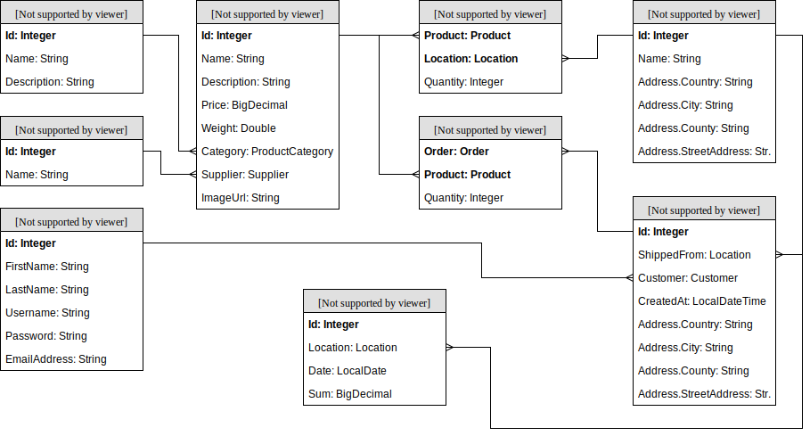

# C#.NET Training: Resources

## Contents

 - [Fundamentals](#Fundamentals)
 - [Working Mode](#working-mode)
 - [Environment](#environment)
 - [Time Bookings](#time-bookings)
 - [Online Shop](#online-shop)
 - [Chapters](#chapters)
   * [0. Prerequisites](#0-prerequisites)
   * [1. WEB API](#1-WEB-API)
		* [C1. Create Web API project](#C1-Create-Web-API-project)
   * [2. UI](#2-ui)
   * [3. Security](#3-Security)
   * [4. Exercises](#4-Exercises)
   * [OPT-1. ODBC](#opt-1-odbc)
   * [OPT-2. MongoDB](#opt-2-mongodb)
   * [OPT-3. OAuth](#opt-3-oauth)
   * [OPT-4. RabbitMQ](#opt-6-rabbitmq)
   * [OPT-5. WebSocket](#opt-8-websocket)

## Fundamentals

C# is a object-oriented and type-safe programming language. C# enables developers to build many types of applications that run in .NET.

C# programs run on .NET, a virtual execution system called the common language runtime (CLR) and a set of class libraries. The CLR is the implementation by Microsoft of the common language infrastructure (CLI), an international standard.

What is .NET?
.NET is a free, open-source development platform for building many kinds of apps, such as:

- Web apps, web APIs, and microservices
- Serverless functions in the cloud
- Cloud native apps
- Mobile apps
- Desktop apps
- Windows WPF
- Windows Forms
- Universal Windows Platform (UWP)
- Games
- Internet of Things (IoT)
- Machine learning
- Console apps
- Windows services

Types and variables

A type defines the structure and behavior of any data in C#. The declaration of a type may include its members, base type, interfaces it implements, and operations permitted for that type. A variable is a label that refers to an instance of a specific type.

There are two kinds of types in C#: value types and reference types. Variables of value types directly contain their data. Variables of reference types store references to their data, the latter being known as objects. With reference types, it's possible for two variables to reference the same object and possible for operations on one variable to affect the object referenced by the other variable. With value types, the variables each have their own copy of the data, and it isn't possible for operations on one to affect the other (except for ref and out parameter variables).

An identifier is a variable name. An identifier is a sequence of unicode characters without any whitespace. An identifier may be a C# reserved word, if it's prefixed by @. Using a reserved word as an identifier can be useful when interacting with other languages.

C#'s value types are further divided into simple types, enum types, struct types, nullable value types, and tuple value types. C#'s reference types are further divided into class types, interface types, array types, and delegate types.

- Value types (https://docs.microsoft.com/en-us/dotnet/csharp/language-reference/builtin-types/value-types)
  - Simple types
  - Enum types
  - Struct types
  - Nullable value types
  - Tuple value types
- Reference types (https://docs.microsoft.com/en-us/dotnet/csharp/language-reference/keywords/reference-types)
  - Class types
  - Interface types
  - Array types
  - Delegate types

C# programs use type declarations to create new types. A type declaration specifies the name and the members of the new type. Six of C#'s categories of types are user-definable: class types, struct types, interface types, enum types, delegate types, and tuple value types. You can also declare record types, either record struct, or record class. Record types have compiler-synthesized members. You use records primarily for storing values, with minimal associated behavior.

- A class type defines a data structure that contains data members (fields) and function members (methods, properties, and others). Class types support single inheritance and polymorphism, mechanisms whereby derived classes can extend and specialize base classes.
https://docs.microsoft.com/en-us/dotnet/csharp/language-reference/keywords/class

- A struct type is similar to a class type in that it represents a structure with data members and function members. However, unlike classes, structs are value types and don't typically require heap allocation. Struct types don't support user-specified inheritance, and all struct types implicitly inherit from type object.
https://docs.microsoft.com/en-us/dotnet/csharp/language-reference/builtin-types/struct

- An interface type defines a contract as a named set of public members. A class or struct that implements an interface must provide implementations of the interface's members. An interface may inherit from multiple base interfaces, and a class or struct may implement multiple interfaces.
https://docs.microsoft.com/en-us/dotnet/csharp/language-reference/keywords/interface

- A delegate type represents references to methods with a particular parameter list and return type. Delegates make it possible to treat methods as entities that can be assigned to variables and passed as parameters. Delegates are analogous to function types provided by functional languages. They're also similar to the concept of function pointers found in some other languages. Unlike function pointers, delegates are object-oriented and type-safe.
https://docs.microsoft.com/en-us/dotnet/csharp/programming-guide/delegates/using-delegates

Object Oriented programming

- Classes, structs, and records
  Definition of a class, struct, or record—is like a blueprint that specifies what the type can do. An object is basically a block of memory that has been allocated and configured according to the blueprint. This article provides an overview of these blueprints and their features. The next article in this series introduces objects. https://docs.microsoft.com/en-us/dotnet/csharp/fundamentals/tutorials/oop

- Object is basically a block of memory that has been allocated and configured according to the blueprint.
  https://docs.microsoft.com/en-us/dotnet/csharp/fundamentals/object-oriented/objects 

- Inheritance enables you to create new classes that reuse, extend, and modify the behavior defined in other classes.
  https://docs.microsoft.com/en-us/dotnet/csharp/fundamentals/object-oriented/inheritance

- Polymorphism is the ability of objects of different types to provide a unique interface for different implementations of methods
  https://docs.microsoft.com/en-us/dotnet/csharp/fundamentals/object-oriented/polymorphism

## Working Mode

The road-map consists of several steps. In each step, a set of theoretical concepts are explored, supported by reference documentation, book chapters, tutorials and videos. In parallel, a simple application will be built with the learned concepts: the *Online Shop* application.

After the learning material for a given step was sufficiently explored, either some new functionality will be added to this application or old functionality will be refactored.

The application will have little-to-no user interface. Developers are expected to perform developer tests with Postman once the REST APIs are implemented.

All the code written must be published on GitHub. Commits must be pushed when each individual chapter is finished. In order to request a code review from the trainers, you must [open a pull request](https://help.github.com/en/articles/creating-a-pull-request) from the `develop` to the `master` branch.

## Environment

You can work using your local environment:
 - You can install [.NET 6.0 SDK (LTS)](https://dotnet.microsoft.com/en-us/download)
 - You need to install [Visual Studio 2022 - Community Edition](https://visualstudio.microsoft.com/vs/community/)
 - or you can install [Visual Code](https://code.visualstudio.com/) - if you like to work with on .NET core under Linux (but also in Windows) using bash or command line/power shell
 
 
## Time Bookings

Use the following booking codes to track activities:

| Booking Code                            | Activity                                                                                                          |
|-----------------------------------------|-------------------------------------------------------------------------------------------------------------------|
| Schul. & Einarb. C#  - allg. Einarb.    | Going through the learning material; tutorials; doing own theoretical investigations; attending presentations.    |
|  

In the booking description, please use the following format: `Chapter: Brief activity description`, for the regular calls, simply state the name of the meeting. 

Examples: `1: Reading about dependency injection, spring basics`, `2: Setting up the project.`.

## Online Shop
The application will deal with the management and daily functioning of a small online shop. Business processes:
 - **Order creation**: an end customer places an order to buy several products (based on the availability of the products in the stock).
 - **Stock management**: the existing product stocks are updated automatically based on the orders placed by customers.
 - **Shop analytics**: the management must be able to view the evolution of the daily revenue for each individual location of the shop.

Throughout the application, we assume that prices are always in EUR and weights are always in KG. 

## Chapters

### 0. Prerequisites

Goal: Getting familiar with the ecosystem around c#. You can skip this chapter if you have already worked with C# and Git.

Required Reading:

 - [Git Basics](https://git-scm.com/book/en/v1/Getting-Started-Git-Basics)  (skip this if you are already familiar with git commands)
 - [Install .NET 6 SDK](https://dotnet.microsoft.com/en-us/learn/dotnet/hello-world-tutorial/intro)
 - [Install Visual Code](https://code.visualstudio.com/)  - or you can use the [Visual Studio 2022]
 - [Install Visual Studio Community 2022 ](https://visualstudio.microsoft.com/vs/community/)   - recommended
 - [Starting with Visual Studio](https://www.youtube.com/watch?v=iC3CJcYxkl0&t=107s&ab_channel=MicrosoftVisualStudio)
 - [Intro To The .NET CLI - How To Use It, Why We Need It, And More](https://www.youtube.com/watch?v=RQLzp2Z8-BE&ab_channel=IAmTimCorey)
 - [C# (c sharp)](https://www.tutorialspoint.com/csharp/index.htm)
 - [Intro to Visual Studio in 5 minutes](https://www.youtube.com/watch?v=5AOp8zFu4Vg&ab_channel=dotNET)
 - [Visual Studio 2022 Tips & Tricks](https://www.youtube.com/watch?v=etHfCFwH6MY&ab_channel=ClaudioBernasconi)
 - [Build .NET applications with C#](https://docs.microsoft.com/en-us/learn/paths/build-dotnet-applications-csharp/?WT.mc_id=dotnet-35129-website)

Online Shop: *nothing to do*.

Further Resources:

 - [GitHub - Hello World](https://guides.github.com/activities/hello-world/)
 - [Git - CLI Fundamentals](https://www.youtube.com/watch?v=HVsySz-h9r4)
 - [Nuget in 5 minutes](https://Nuget.apache.org/guides/getting-started/Nuget-in-five-minutes.html)
 
### 1. WEB API
#### C1. Create Web API project
Goal: Understand dependency injection and how it is realized with .NET

Required Reading:

 - [What is Dependency Injection?](https://stackoverflow.com/a/130862/7612556)

Online Shop: *nothing to do*.

Further Resources:

 - [Spring in Action](https://1drv.ms/b/s!AiBPL7npTofshY5PJim4M5RiiOyu7w) - Part 1, Chapter 1
 - [What is Spring all about?](https://www.youtube.com/watch?v=gq4S-ovWVlM)
 - [Spring Reference - Overview](https://docs.spring.io/spring/docs/5.1.6.RELEASE/spring-framework-reference/overview.html#overview)
 - [Spring Reference - Core](https://docs.spring.io/spring/docs/5.1.6.RELEASE/spring-framework-reference/core.html#spring-core) - Chapters 1 to 4

### 2. UI

Goal: Generate a new project and be able to use the out-of-the-box Spring Boot features.

Required Reading:

 - [Building an Application with Spring Boot](https://spring.io/guides/gs/spring-boot/)
 - [Configuration Properties](https://www.baeldung.com/configuration-properties-in-spring-boot)
 - [Introduction to Lombok](https://www.baeldung.com/intro-to-project-lombok)
 - [Introduction to H2 Database](http://www.topC#tutorial.com/misc/introduction-to-h2-database/)

Online Shop:
 
 > Register an account on GitHub and accept the training [GitHub Classroom Assignment](https://classroom.github.com/a/qiaU7uWM). This will create a new GitHub repository for you. Clone this repository locally and checkout the `develop` branch. During the course of the training, you will commit and push your work on this branch.
 >
 > Go to "Spring Initializr" and generate a new project:
 > - Group: `ro.msg.learning`,
 > - Artifact: `shop`,
 > - Dependencies: `Web`, `Security`, `JPA`, `Flyway`, `H2`, `Lombok`.
 >
 > Extract the generated `zip` file into the previously cloned repository. Import this project into your IDE. You can delete the `mvnw`, `mvnw.cmd` and `.mvn` files / folders as you have Nuget in the IDE anyway.
 >
 > Enable the [H2 console for your application](https://docs.spring.io/spring-boot/docs/2.1.4.RELEASE/reference/html/boot-features-sql.html#boot-features-sql-h2-console) and configure H2 to use a [file-based storage somewhere on your computer](https://stackoverflow.com/questions/37903105/how-to-configure-spring-boot-to-use-file-based-h2-database/37969181#37969181).

Further Resources:
 - [Spring Boot Reference](https://docs.spring.io/spring-boot/docs/2.1.4.RELEASE/reference/html/index.html) - Parts I and II
 - [Spring Boot Tomcat Sample](https://github.com/oktadev/okta-spring-boot-tomcat-example)
 - [Common Application Properties](https://docs.spring.io/spring-boot/docs/2.1.4.RELEASE/reference/html/common-application-properties.html)
 - [Introduction to SLF4J](https://www.baeldung.com/slf4j-with-log4j2-logback)

### 3. Security

Goal: Initialize the database schema and map the tables to C# classes using JPA.

Required Reading:

 - [Database migrations with Flyway](https://www.baeldung.com/database-migrations-with-flyway)
 - [JPA - Entities](https://docs.oracle.com/C#ee/5/tutorial/doc/bnbqa.html)
 - [JPA - JPQL](https://www.tutorialspoint.com/jpa/jpa_jpql.htm)
 - [Introduction to Spring Data JPA](https://www.baeldung.com/the-persistence-layer-with-spring-data-jpa)

Online Shop:
 
 > Create a data model for your application in a Flyway SQL migration. You can refine the model by adding unique indexes (e.g. supplier name) and introducing artificial PKs instead of composite ones and also add a unique index.
 >
 > Translate this data model into C# entity classes. Use Lombok to annotate these classes with `@Data` annotations to generate getters, setters, equals and hashCode. Hint: *it might be useful to create a base entity class (containing just the primary key) or an interface (containing the primary key getter and setter) to be able to handle entities generically later on.*
 > 
 > Annotate all the entities with the proper JPA annotations (`@Entity`, `@OneToMany`, etc). Write Spring Data JPA repositories to allow easy access to your entities. 

Further Resources:
 - [Spring Data Reference](https://docs.spring.io/spring-data/jpa/docs/2.1.6.RELEASE/reference/html/)
 - [Spring Database Initialization](https://docs.spring.io/spring-boot/docs/2.1.4.RELEASE/reference/html/howto-database-initialization.html#howto-execute-flyway-database-migrations-on-startup)
 - [Spring in Action](https://1drv.ms/b/s!AiBPL7npTofshY5PJim4M5RiiOyu7w) - Part 1, Chapter 3.2

### 4. Exercises

Goal: Group business logic into service classes and expose this logic through REST interfaces.

Required Reading:

 - [What is REST?](https://medium.com/extend/what-is-rest-a-simple-explanation-for-beginners-part-1-introduction-b4a072f8740f) - Parts 1 and 2
 - [Spring REST Tutorial](https://spring.io/guides/tutorials/rest/)
 - [Spring Service Components](https://www.tutorialspoint.com/spring_boot/spring_boot_service_components.htm)
 - [Strategy Design Pattern](https://en.wikipedia.org/wiki/Strategy_pattern)

Online Shop:
 > Create a simple API for exposing the products and product categories: 
 >
 > - Define a DTO (data transfer object) POJO which combines the properties from a product and its respective category. 
 > - Create a service class which uses the repositories in order to: create, update, delete, read by ID and read all the product (as DTO instances).
 > - Build a REST Controller which uses this service.
 >
 > Create a service class that handles the creation of orders. The following constraints apply:
 >
 > - You get a single C# object as input. This object will contain the order timestamp, the delivery address and a list of products (product ID and quantity) contained in the order.
 > - You return an Order entity if the operation was successful. If not, you throw an exception.
 > - The service has to select a strategy for finding from which locations should the products be taken. The strategy should be selected based on a `@Configuration`. The following initial strategies should be created: 
 >   - **Single location** - find a single location that has all the required products (with the required quantities) in stock. If there are more such locations, simply take the first one based on the ID.
 >   - **Most abundant** - take each product from the location which has the largest stock for that particular product.
 > - The service then runs the strategy, obtaining a list of objects with the following structure: location, product, quantity (= how many items of the given product are taken from the given location). If the strategy is unable to find a suitable set of locations, it should throw an exception.
 > - The stocks are be updated by subtracting the shipped goods. 
 > - Afterwards the order is persisted in the database and returned.
 > 
 > Create a Rest Controller for the "Create order" operation, which should have a `POST` mapping accepting a JSON request body and producing a JSON response body.
 
Further Resources:

 - [RESTful API Designing Guidelines](https://hackernoon.com/restful-api-designing-guidelines-the-best-practices-60e1d954e7c9)
 - [DDD and Spring](https://www.baeldung.com/hexagonal-architecture-ddd-spring)
 - [Transaction Management](https://docs.spring.io/spring/docs/5.1.6.RELEASE/spring-framework-reference/data-access.html#transaction)
 - [ConditionalOnProperty](https://docs.spring.io/spring-boot/docs/2.1.4.RELEASE/api/org/springframework/boot/autoconfigure/condition/ConditionalOnProperty.html)
 - [Spring in Action](https://1drv.ms/b/s!AiBPL7npTofshY5PJim4M5RiiOyu7w) - Part 2, Chapter 6

### OPT-1. ODBC

## OPT-2. MongoDB

Goal: Store unstructured data in a NoSQL database.

Required Reading:

 - [NoSQL Databases](https://searchdatamanagement.techtarget.com/definition/NoSQL-Not-Only-SQL)
 - [What is MongoDB?](https://www.mongodb.com/what-is-mongodb)
 - [Accessing Data with MongoDB](https://spring.io/guides/gs/accessing-data-mongodb/)

Online Shop:

Further Resources:

 - [Spring MongoDB Reference](https://docs.spring.io/spring-data/mongodb/docs/2.1.6.RELEASE/reference/html/)

### OPT-3. OAuth

Goal: Secure the online shop with OAuth 2.0.

Required Reading:

 - [The Simplest Guide to OAuth 2.0](https://medium.com/@darutk/the-simplest-guide-to-oauth-2-0-8c71bd9a15bb)

Online Shop:

 > Configure your application as an *Authorization Server* with an in-memory store of clients. Use Postman to test that you are able to issue a token using the `password` grant.
 >
 > Now also configure your application as a *Resource Server* and secure your REST APIs using OAuth.
 >
 > Lastly, enable your application to additionally use the GitHub Authorization Server. To do this, you will first need to [register a new OAuth app on GitHub](https://developer.github.com/apps/building-oauth-apps/creating-an-oauth-app/) or contact the trainers for obtaining the credentials of an existing client.

Further Resources:

 - [Spring OAuth 2 Developers Guide](https://projects.spring.io/spring-security-oauth/docs/oauth2.html)
 - [Spring SSO vs Resource Server](https://www.baeldung.com/spring-security-oauth2-enable-resource-server-vs-enable-oauth2-sso)

### OPT-4. RabbitMQ

Goal: Asynchronously communicate with a background worker application.

Required Reading:

 - [Understanding Message Brokers](https://medium.com/@ekanshbansal/understanding-message-brokers-using-rabbitmq-5c8b41ecf0f2)

Online Shop:

Further Resources:

 - [Spring AMQP Reference](https://docs.spring.io/spring-amqp/docs/2.1.5.RELEASE/reference/)
 - [An Introduction to Message Brokers](https://medium.com/@xaviergeerinck/an-introduction-to-message-brokers-9bd203b4ebbd)

### OPT-5. WebSocket

Goal: Publish events though WebSocket to allow potential user interfaces to automatically update their displayed data.

Required Reading:

 - [What are WebSockets](https://pusher.com/websockets)
 - [An Introduction to WebSocket](https://blog.teamtreehouse.com/an-introduction-to-websockets)
 

Online Shop:

Further Resources:

 